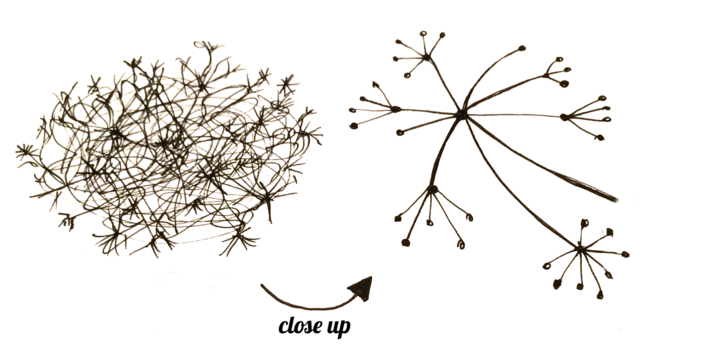

# Como a Internet funciona

As gerações y e z estão tão acostumadas com Internet e com o seu fácil acesso, que parece um pouco difícil entender exatamente o que ela é e o seu funcionamento. Eis alguns tópicos abordados neste artigo, que pretende esclarecer um pouco sobre esse mundo desconhecido:

- O que é a Internet?
- Como funciona?
    - Rede local e rede pública
    - O TCP/IP
- Quem fornece a internet?
- Como funcionam os websites?
- DNS: por que não precisamos decorar os IP dos computadores que queremos visitar
- Por que a Internet é tão veloz?
- A World Web Wide (WWW)

***

## O que é a Internet?

A internet é uma rede global de bilhões e bilhões de computadores e outros serviços eletrônicos conectados, que podem se comunicar entre si, trocando dados digitais. Como sabemos, com a Internet podemos acessar uma pilha de informações, se conectar com pessoas de todo lugar do mundo e muitas outras coisas. Nós podemos fazer tudo isso conectando um computador a Internet, o que é chamado também de "ficar online".

## Como funciona?
 Mas, se os computadores conectados trocam dados, como esses dados são enviados ou recebidos? **Através de cabos.** Sim, isso mesmo, mas vai muito além do cabo que o servidor da sua internet conecta no seu roteador quando você contrata uma bandalarga de internet. Os computadores de todo o mundo são conectados por longos cabos, submarinos e terrestres, cabos de fibra óptica, de cobre etc. E estes cabos são intermediados por roteadores, modems e switches, que basicamente são responsáveis por regular o fluxo de informações desses cabos.

 

Portanto, é importante ter em mente que a internet é algo **físico**, mais ou menos como a imagem abaixo:

Você pode visitar o site *Submarine Cable Map* (<http://submarinecablemap.com>) para verificar o qual complexa é a Internet.

Existem cabos que permitem um fluxo de vários terabytes de informações, então não é tão simples saber como as informações se distribuem e chegam no endereço correto. Então, vamos esclarecer alguns conceitos para ficar mais fácil.

### Rede local e Rede externa
A **rede local** é uma rede de computadores e equipamentos eletrônicos restrita a um espaço físico como uma casa, uma empresa ou um prédio. É chamada de LAN (*Local Area Network*). Numa rede local, é possível configurar os computadores para terem acesso aos arquivos e aos sistemas dos computadores pertencentes a mesma rede.
A **rede externa** é basicamente toda a rede externa à nossa rede local, é a Internet. Quando contratamos um serviço de Internet, estamos pedindo para nos conectar aos demais computadores do mundo.
Como? A rede local se conecta com a rede externa por meio do roteador, que é a interface entre os dois. O roteador funciona basicamente como um portão que controla o acesso da rede externa (geral) para a rede local. Assim, nós temos o controle das informações na nossa rede local e decidimos o que queremos enviar ou receber da rede externa.

Mas como se dá esse controle? O nosso roteador cria um IP (Internet Protocol) para os nossos computadores da rede local e permite a comunicação entre eles. Já para se comunicar com a *Internet*, ele cria um outro IP, que este sim pode ser acessado pela rede externa, e nós que decidimos o que atravessa o roteador para chegar à parte externa ou não.

**

### O TCP/IP
O **TCP/IP**(Transmission Control Protocol/ Internet Protocol) é o conjunto de protocolos mais utilizado para envio e recebimento de dados da internet. Protocolo é uma espécie de linguagem para que dois computadores possam se comunicar. Se duas máquinas estiverem conectadas mas não falarem a mesma "língua", não haverá comunicação entre elas. Para se ter uma ideia, fazem parte desse conjunto o SMTP (protocolo para envio de e-mails), FTP (protocolo para envio de arquivos) e o famoso HTTP (protocolo para navegação na web, que veremos mais a frente).
 É um pouco complexo e é dividido em algumas etapas de funcionamento, que podem ser vista neste *[site](https://www.citisystems.com.br/protocolo-tcp-ip/ "Entenda como Funciona o Protocolo TCP-IP")*, para quem quiser se aprofundar.

## Quem fornece a Internet?
Por ser uma rede de computadores, pessoas físicas e jurídicas, empresas e órgãos governamentais podem acessar a internet sem qualquer restrição. Sendo assim, não há uma empresa que forneça ou regulamente a internet. Assim, a internet é de todos e não é de ninguém ao mesmo tempo.

## Como funcionam os websites?
Um *website* nada mais é que um conjunto de arquivos salvos no disco rígido de algum computador. Para armazenar esses arquivos, usamos computadores super potentes  que são chamados de *servidores*. São computadores com grande processamento e memória, que tem como função servir *softwares*, arquivos e outros serviços. Mas ok, voltando ao *website*, o que todos os websites têm em comum é um arquivo chamado `HTML` (Linguagem de Marcação de Hipertexto), que basicamente é o esqueleto de todo site, onde colocamos os textos, imagens, vídeos, barras de navegação e tudo que quisermos hospedar no nosso site.
Além do HTML, tem vários outros responsáveis por dar cor, movimento e ações aos nossos sites, mas não vamos entrar em detalhes.
O que é importante ter em mente é que quando estamos acessando um site no nosso navegador, estamos requisitando que nosso computador pegue a informação que está armazenada em outro computador (cujo site está hospedado) e traga para a nossa tela. É assim também que acontece quando fazemos o download de músicas, vídeos e outros arquivos. 
Outra coisa importante de entender, é que esses dados são enviados para nós através daqueles cabos de internet que foram falados do início do artigo. Para vermos como a Internet é física!

## DNS: por que não precisamos decorar os IP dos computadores que queremos visitar
Imagine se ao acessar um site como o *GitHub*, tivéssemos que saber exatamente o endereço do PC em que está hospedado o site do *GitHub*. Seria uma tarefa muito complicada acessar e decorar o endereço de qualquer site, e é por isso existe o DNS (Domain Name System - Sistemas de nomes de domínios), que traduzem o IP para um nome mais fácil de decorar. Assim, só digitando <github.com> você acessa facilmente o website do *GitHub*.

## Por que a Internet é tão veloz?
Você já se perguntou porque a internet é tão rápida? Por exemplo, podemos acessar um site que está hospedado em Los Angeles (mesmo não sabendo disso), mas é só pesquisar no *Google* e em menos de um segundo, o website aparece na nossa tela, por que será? Isso acontece porque assim outros meios de comunicação, a Internet utiliza várias formas de energia eletromagnética para a transmissão de seus dados, e energia eletromagnética viaja muito rápido, cerca de 300.000 km/s (velocidade da luz).

## A World Web Wide (WWW)
A ***World Wide Web*** também conhecida como **WWW** ou simplesmente **Web**, é a coleção de todos os websites que podem ser encontrados na Internet, ou, melhor dizendo, é caminho que permite o acesso a estes. Para isso, é necessário um navegador para ler os websites. O navegador é onde você vê imagens, textos e vídeos, onde envia e recebe coisas e também onde se conecta a outras pessoas. E o ato de clicar em links, visitar websites e interagir com o conteúdo oferecido na web se chama navegar.

A Web quando foi criada tinha três elementos fundamentais que são usados até hoje, são eles: o HTML, o HTTP e a URL. Os conceitos destes elementos estão reunidos na tabela abaixo: 

| Elemento                           	| Descrição                                                                                                                      	|
|------------------------------------	|--------------------------------------------------------------------------------------------------------------------------------	|
| HTML ((Hyper Text Markup Language) 	| É o formatação básica de publicação para a Web. Além de  formatar documentos, permite linkar outros documentos e pesquisas. 	|
| HTTP (Hypertext Transfer Protocol) 	| Permite que documentos HTML sejam requisitados e transmitidos entre  navegadores e servidores de web via Internet.          	|
| URL (Uniform Resource Locator)     	| É um tipo de "endereço" que é único para cada pesquisa na web.                                                                 	|

Os websites ficam hospedados em servidores de web (*Web Servers*), que são computadores onde os arquivos ficam armazenados e podem ser acessados via Internet usando HTTP.

Historicamente, a World Wide Web surgiu de uma necessidade de se facilitar a trasmissão de dados, facilitar o uso e acesso à Internet e a comunicação entre pessoas.

Muitas pessoas confundem Internet e Web e isso é normal. Mas, resumindo a diferença entre Internet e Web, temos: a Internet como a estrutura física da conexão entre computadores, e a Web são arquivos, dados transmitidos por essa estrutura física. É claro que não dá para abordar todas os detalhes desse universo num único texto, então ficamos por aqui. Para mais informações só consultar as referências indicadas no texto e as que estão logo abaixo. Obrigada pela leitura!

***

**Referências:**
*[How The Internet Works. Django Girls.](https://tutorial.djangogirls.org/en/how_the_internet_works/)*
*[Como funciona a internet. Brincando com Ideias.](youtube.com/watch?v=1G48PTHxMco&t=1662s)*
*[O que é TCP/IP](https://www.tecmundo.com.br/o-que-e/780-o-que-e-tcp-ip-.htm)*
*[A diferença entre Internet e World Wide Web. Canaltech.](https://canaltech.com.br/entretenimento/qual-a-diferenca-entre-internet-e-world-wide-web/)*
*[What is the World Wide Web? BBC Bitesize](https://www.bbc.co.uk/bitesize/topics/zkcqn39/articles/z2nbgk7)*
*[Como a Internet chega na sua casa. TechTudo](https://www.techtudo.com.br/noticias/noticia/2011/07/como-internet-chega-na-sua-casa.html)*
